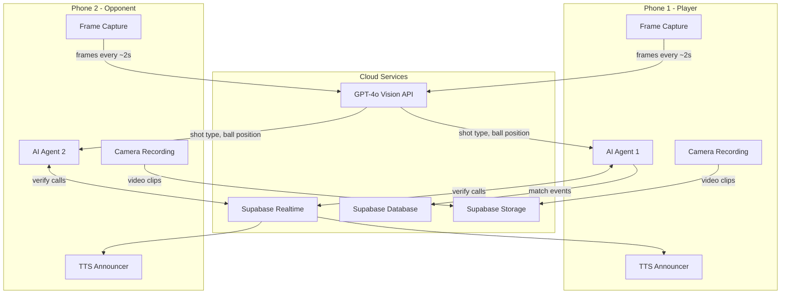
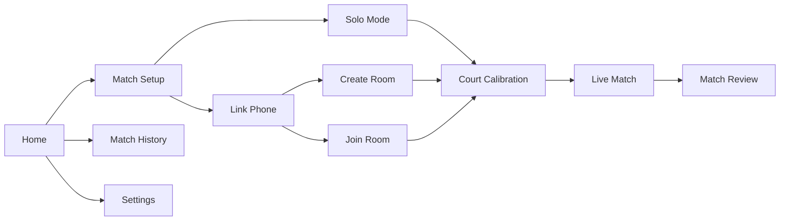

# lov-e - AI Tennis Tracking App

## Architecture Overview




## Tech Stack

- **Expo SDK 52** with Expo Router (file-based navigation)
- **expo-camera** for video recording and frame capture
- **expo-av** for video playback in match review
- **expo-speech** for TTS "in!" / "out!" announcements
- **@supabase/supabase-js** for auth, database, realtime channels, and video storage
- **OpenAI GPT-4o Vision** for frame analysis (shot detection, ball tracking, in/out calls)
- **TypeScript** throughout
- **Zustand** for client-side state management

## Screen Flow




## Project Structure

```
lov-e/
├── app/                           # Expo Router screens
│   ├── (tabs)/
│   │   ├── _layout.tsx            # Tab navigator
│   │   ├── index.tsx              # Home screen
│   │   ├── history.tsx            # Past matches
│   │   └── settings.tsx           # API keys, preferences
│   ├── match/
│   │   ├── setup.tsx              # Solo vs linked, match config
│   │   ├── calibrate.tsx          # Tap 4 court corners
│   │   ├── live.tsx               # Camera view + live AI overlay
│   │   └── [id].tsx               # Match review/replay
│   ├── link/
│   │   ├── create.tsx             # Generate room code
│   │   └── join.tsx               # Enter room code to join
│   └── _layout.tsx                # Root layout
├── components/
│   ├── CameraView.tsx             # Camera wrapper with frame capture
│   ├── CourtOverlay.tsx           # SVG overlay showing court lines
│   ├── ShotTimeline.tsx           # Timeline of tagged shots
│   ├── ScoreBoard.tsx             # Live score display
│   ├── LinkStatus.tsx             # Connection status indicator
│   └── EventBadge.tsx             # Forehand/backhand/in/out badge
├── services/
│   ├── ai/
│   │   ├── frameAnalyzer.ts       # Capture + send frames to GPT-4o
│   │   ├── prompts.ts             # System prompts for tennis analysis
│   │   └── callVerifier.ts        # Consensus logic between agents
│   ├── supabase/
│   │   ├── client.ts              # Supabase client init
│   │   ├── matchRoom.ts           # Create/join/leave rooms
│   │   └── realtimeSync.ts        # Broadcast + listen for events
│   ├── announcer.ts               # TTS wrapper for in/out calls
│   ├── matchEngine.ts             # Tennis scoring state machine
│   └── courtGeometry.ts           # Point-in-polygon for in/out math
├── stores/
│   └── matchStore.ts              # Zustand store for match state
├── types/
│   └── index.ts                   # All shared types
├── constants/
│   └── tennis.ts                  # Court dimensions, scoring rules
├── hooks/
│   ├── useFrameAnalysis.ts        # Hook for periodic frame analysis
│   ├── useMatchRoom.ts            # Hook for realtime room sync
│   └── useAnnouncer.ts            # Hook for TTS announcements
├── app.json
├── package.json
├── tsconfig.json
└── .env.example                   # EXPO_PUBLIC_SUPABASE_URL, etc.
```

## Key Implementation Details

### 1. Camera + Frame Capture

Use `expo-camera` to record video. Every ~2 seconds, capture a frame using `takePictureAsync()`, convert to base64, and send to the AI service. The frame rate is a tradeoff between responsiveness and API cost.

### 2. AI Analysis via GPT-4o Vision

Each captured frame is sent with a structured prompt that asks the model to return JSON:

```typescript
interface FrameAnalysis {
  shotDetected: boolean;
  shotType: 'forehand' | 'backhand' | 'serve' | 'volley' | 'overhead' | null;
  hitter: 'player' | 'opponent' | null;
  ballVisible: boolean;
  ballLanded: boolean;
  landingCall: 'in' | 'out' | null;
  confidence: number; // 0-1
  description: string;
}
```

The prompt will include the court calibration corners so the AI can reason about line calls relative to the visible court geometry.

### 3. Court Calibration

Before a match, the user taps the 4 corners of the court visible in their camera's field of view. These coordinates are stored and sent as context with every frame analysis request, giving the AI spatial reference for in/out decisions.

### 4. Multi-Phone Linking

- Phone A creates a match room (generates a 6-character code, stored in Supabase)
- Phone B enters the code to join
- Both subscribe to a Supabase Realtime channel named `match:{roomCode}`
- Each phone broadcasts its AI analysis events to the channel
- Each phone listens for the other's events

### 5. Agent Call Verification

When both phones are linked, each independently analyzes frames and makes calls. The `callVerifier` service implements consensus:

- **Both agree**: High confidence, announce immediately
- **Disagree**: Use confidence scores; higher confidence wins, or flag as "contested"
- Results are broadcast so both phones announce the same call

### 6. TTS Announcements

`expo-speech` speaks "In!" or "Out!" with configurable voice. On contested calls: "Out! ... Challenged." The announcements are triggered after agent verification completes.

### 7. Supabase Schema

- **profiles**: user settings, display name
- **matches**: match metadata (players, date, score, status)
- **match_events**: every detected shot/call (timestamp, type, player, call, confidence, frame_url)
- **match_rooms**: active linked sessions (room_code, host_id, guest_id, match_id)

### 8. Match Review

After a match, users can scrub through the recorded video. Shot tags appear on a timeline below the video. Tapping a tag jumps to that moment. Events are color-coded by type (forehand=blue, backhand=red, in=green, out=orange).

## Important Caveats

- **AI accuracy**: GPT-4o Vision analyzing 2fps snapshots from a single phone camera will not match Hawk-Eye. It works best for clear, well-lit courts with the phone mounted stably. We'll set expectations in the UI.
- **API cost**: Each frame analysis costs ~$0.01-0.03 depending on image size. A 1-hour match at 2fps = ~3,600 calls. We'll make the capture interval configurable and default to a practical rate.
- **Latency**: Vision API calls take 1-3 seconds. Calls won't be instantaneous but will be announced within a few seconds of a ball landing.

